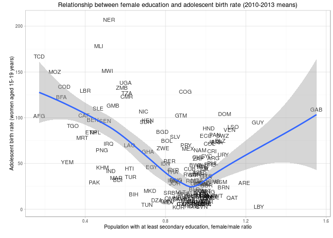

### hdr package

The `hdr` package provides a complete interface to the [United Nations Development Programme Human Development Report API](hdr.undp.org). This data source includes a large amount of human development data, including all the series used to compute the Human Development Index (HDI), as well as the HDI itself.

To get the package:

``` r
library(devtools)
install_github("expersso/hdr")
```

### Usage example

``` r
library(hdr)

# Get a data frame with id and indicator names
head(hdr_indicators)
```

    ##       id                                           indicator
    ## 1  36806      Adolescent birth rate (women aged 15-19 years)
    ## 2 101406                     Adult literacy rate, both sexes
    ## 3  27706                 Carbon dioxide emissions per capita
    ## 4  98106                    Change in forest area, 1990/2011
    ## 5 105906 Combined gross enrollment in education (both sexes)
    ## 6 103706                                     Education index

``` r
# Get the Human Development Index for Germany in 2013
hdi <- get_data(indicator = 137506, country = "DEU", year = 2013)
head(hdi)
```

    ##       id                                 indicator iso3c country year
    ## 1 137506 HDI: Human development index (HDIg) value   DEU Germany 2013
    ##   value
    ## 1 0.911

``` r
# Leave a dimension as NULL (default) to get all values for that dimension
# e.g. all countries and all year for a specific indicator:
df <- get_data(103606)
head(df)
```

    ##       id         indicator iso3c     country year value
    ## 1 103606 HDI: Income index   AFG Afghanistan 1980 0.489
    ## 2 103606 HDI: Income index   AFG Afghanistan 1985 0.513
    ## 3 103606 HDI: Income index   AFG Afghanistan 1990 0.486
    ## 4 103606 HDI: Income index   AFG Afghanistan 1995 0.327
    ## 5 103606 HDI: Income index   AFG Afghanistan 2000 0.328
    ## 6 103606 HDI: Income index   AFG Afghanistan 2005 0.366

``` r
# Get the adolescent birth rate for all years and all countries
br <- get_data(c(24806, 36806), year = 2010:2013)

library(dplyr)
library(tidyr)

br <- br %>% 
  group_by(id, iso3c) %>% 
  summarise(mean_val = mean(value, na.rm = TRUE)) %>% 
  spread(id, mean_val) %>% 
  .[complete.cases(.), ] %>% 
  setNames(c("iso3c", "fem_ed", "birth_rate"))

library(ggplot2)

ggplot(br, aes(x = fem_ed, y = birth_rate, label = iso3c)) +
  geom_text(size = 3, alpha = 0.75) +
  geom_smooth() +
  theme_light(8) +
  labs(y = "\nAdolescent birth rate (women aged 15-19 years)",
       x = "Population with at least secondary education, female/male ratio\n",
       title = "Relationship between female education and adolescent birth rate (2010-2013 means)")
```


